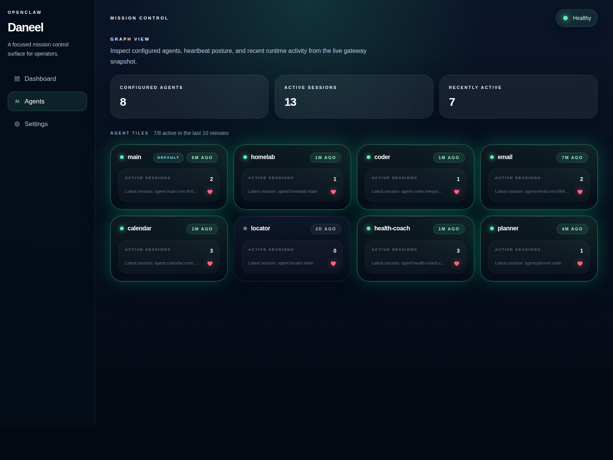

# Daneel

Daneel is a Dioxus-based mission control UI for OpenClaw.

It is currently an early proof of concept focused on:

- a Rust-first Dioxus fullstack app
- typed routes and a shared operator UI shell
- live OpenClaw gateway connectivity through Dioxus server functions
- an agents view that renders live agent and active-session data



## Current Features

- Dashboard with live gateway health status
- Agents page with compact live agent tiles
- Settings route scaffold
- Tailwind 4 styling pipeline
- Fullstack development workflow with hot reload

## Tech Stack

- Rust 2024
- Dioxus 0.7
- Dioxus server functions
- Tailwind CSS 4
- OpenClaw Gateway over loopback WebSocket

## Getting Started

Prerequisites:

- `rustc`
- `cargo`
- `dx`
- `npm`

Install or verify the web target if needed:

```bash
rustup target add wasm32-unknown-unknown
```

Start the app:

```bash
npm start
```

By default this serves the app at:

```text
http://127.0.0.1:4127
```

For a lighter development workflow:

```bash
npm run dev
```

## Developing Inside An OpenClaw Instance

This project is intended to work well when developed directly inside an OpenClaw machine, which is how the current environment is set up.

The expected local assumptions are:

- OpenClaw is installed on the same machine
- the OpenClaw gateway is reachable over loopback
- the gateway config lives at `~/.openclaw/openclaw.json`
- Daneel can read:
  - `gateway.port`
  - `gateway.auth.token`

Recommended setup inside an OpenClaw instance:

1. Clone the repository somewhere under your normal development workspace.
2. Make sure Rust, Cargo, the Dioxus CLI, and npm are available.
3. Verify the OpenClaw config exists:

```bash
test -f "$HOME/.openclaw/openclaw.json"
```

4. Verify the gateway config values are present:

```bash
jq '.gateway.port, .gateway.auth.token' "$HOME/.openclaw/openclaw.json"
```

5. Verify the Rust and Dioxus toolchain:

```bash
. "$HOME/.cargo/env"
rustc --version
cargo --version
dx --version
rustup target list --installed
```

6. Make sure the WASM target is installed:

```bash
rustup target add wasm32-unknown-unknown
```

7. Install the frontend dependencies:

```bash
npm install
```

8. Start the app:

```bash
npm start
```

This repo’s normal local development URL is:

```text
http://127.0.0.1:4127
```

If you are connected to that OpenClaw machine through VS Code Remote or a similar remote environment, forward port `4127` and open the forwarded URL in your local browser.

Notes for this environment:

- Daneel talks to OpenClaw through server-side Dioxus server functions.
- The browser does not connect to the gateway directly.
- A working local OpenClaw gateway is part of the expected dev setup.
- If the gateway is unavailable, the dashboard and agents route will render degraded or failed backend states instead of live data.

## Validation

Minimum checks:

```bash
npm run build:css
cargo fmt --all
cargo check
cargo check --features server
```

## Project Docs

- [AGENTS.md](AGENTS.md)
- [docs/daneel_requirements.md](docs/daneel_requirements.md)
- [docs/daneel_technical_design.md](docs/daneel_technical_design.md)
- [docs/milestones/proof-of-concept-1/poc_v1_task_breakdown.md](docs/milestones/proof-of-concept-1/poc_v1_task_breakdown.md)
- [CONTRIBUTING.md](CONTRIBUTING.md)

## License

Licensed under the Apache License, Version 2.0.
See [LICENSE](LICENSE).
